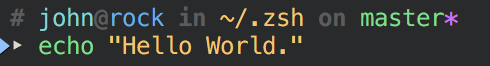

# zsh-config 🐚	⚙️

## Features
* [Syntax Highlighting](https://github.com/zsh-users/zsh-syntax-highlighting.git)
* [Colored Prommpt](#prompt) inlc. Git Branch Name and Exit Code
* Completions
  * for Commands and Parameters; hit `Tab`
  * for Commands and Parameters from history search with [fzf](https://github.com/junegunn/fzf#installation); hit `Ctrl` + `Space`
* Search History
  * by Substrings; hit `Arrow Up`
  * Improved Version of `Ctrl` + `R` search with [fzf](https://github.com/junegunn/fzf#installation)
* Jump to visited Directories with [zjump](https://github.com/qoomon/zjump.git); command `j <PART_OF_DIR_PATH>...`
* Handy Aliases, see [`modules/alias.zsh`](modules/alias.zsh)
* Handy optional Utils, see [Utils Directory](/utils); load by `zgem bundle <UTIL_NAME>`
* and a lot more..., see [Configuration Modules](#configuration-modules)

## Installation
* [install zsh](https://github.com/robbyrussell/oh-my-zsh/wiki/Installing-ZSH#how-to-install-zsh-in-many-platforms)
* `git clone --depth 1 https://github.com/qoomon/zsh-config.git "$HOME/.zsh"`
* `$HOME/.zsh/install.zsh`
  * installs this config for current user
* [install fzf](https://github.com/junegunn/fzf#installation), it's mandatory to make following [plugins](#plugins) work
  * [zjump](https://github.com/qoomon/zjump.git)
  * [zsh-history-search](https://github.com/qoomon/zsh-history-search.git)

## Main Configuration
  [`zshrc.zsh`](zshrc.zsh)
  
### Configuration Modules
* [`modules/plugins.zsh`](modules/plugins.zsh)
* [`modules/general.zsh`](modules/general.zsh)
* [`modules/alias.zsh`](modules/alias.zsh)
* [`modules/history.zsh`](modules/history.zsh)
* [`modules/prompt.zsh`](modules/prompt.zsh)
* [`modules/completions.zsh`](modules/completions.zsh)

### Plugins
* [zsh-config](/utils/zconfig.zsh)
  * `zconfig cd` - cd to `$ZCONFIG_HOME`
  * `zconfig edit [EDITOR]` - open config in `$EDITOR` or in given editor
  * `zconfig update` - updates config an [zgem](https://github.com/qoomon/zgem) plugins
* [zjump](https://github.com/qoomon/zjump.git)
  * `j` - directory history search with [fzf](https://github.com/junegunn/fzf)
* [zsh-history-search](https://github.com/qoomon/zsh-history-search.git)
  * `ctrl + R` - command history search with [fzf](https://github.com/junegunn/fzf)
  * `ctrl` + `SPACE` - command argument history search with [fzf](https://github.com/junegunn/fzf)
 * [zsh-history-substring-search](https://github.com/zsh-users/zsh-history-substring-search.git) 
 * `UP/DOWN` - circle through command history and filter by current command line 
* [zsh-syntax-highlighting](https://github.com/zsh-users/zsh-syntax-highlighting.git)
* [zsh-completions](https://github.com/zsh-users/zsh-completions.git)
* [zsh-theme-qoomon](https://github.com/qoomon/zsh-theme-qoomon.git)

### [Prommpt](https://github.com/qoomon/zsh-theme-qoomon.git)
* Multiline Prompt
* Root user highlight
* GIT status of current directory
  * `*` dirty flag
  * `⇡`/`⇣` before/behind
* Return code after command, if it's not `0`

## Terminal Colors Schemes
* for [iTerm](app_configs/iterm2/qoomon.itermcolors)
* for [macOS Terminal](app_configs/terminal/qoomon.terminal)

## Command Line Util Collection
  * macOS
    * [`install-utils-macos.sh`](app_configs/iterm2/install-utils-macos.sh)  - install common command line utils

## Misc Zsh Know-How

### Shortcuts

* `CTRL + A`	Move to the beginning of the line
* `CTRL + E`	Move to the end of the line
* `CTRL + [left arrow]`	Move one word backward (on some systems this is `ALT + B`)
* `CTRL + [right arrow]`	Move one word forward (on some systems this is `ALT + F`)

* `CTRL + X`  -> `CTRL + E` Edit command line within $EDITOR
* `CTRL + _` Undo last input
* `CTRL + K` Clear the characters on the line after the current cursor position
* `CTRL + U` Clear the entire line
* `ESC  + [backspace]` or `CTRL + W` Delete the word in front of the cursor
* `ESC  + D` Delete the word after the cursor
* `CTRL + W` delete last word

* `ESC  + Q` Push current line on a stack until next command line

* `CTRL + C` Terminate/kill current foreground process
* `CTRL + Z` Suspend/stop current foreground process
 * `fg` Run process again in foreground
 * `bg` Run process again in background
* `CTRL + S` Stop output to screen
* `CTRL + Q` Re-enable screen output

* `ESC  + H` Open man page for current command

* `CTRL + R` Search history
* `CTRL + G` Escape from search mode

* `CTRL + L` Clear screen

### Commands
* `vared <VARIABLE>` On-the-fly editing of `<VARIABLE>`
* `!!`               Execute last command in history
* `!<PEFIX>`         Execute last command in history beginning with `<PEFIX>`
* `!<PEFIX>:p`       Print last command in history beginning with `<PEFIX>`

---
**Sources**
* http://reasoniamhere.com/2014/01/11/outrageously-useful-tips-to-master-your-z-shell/
* http://www.rayninfo.co.uk/tips/zshtips.html
* http://grml.org/zsh/zsh-lovers.html
* http://www.bash2zsh.com/zsh_refcard/refcard.pdf
* http://www.geekmind.net/2011/01/shortcuts-to-improve-your-bash-zsh.html
